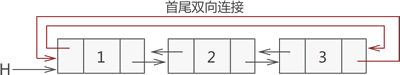

[Home Page](https://qiwu000.github.io/home.html)

[Back](https://qiwu000.github.io/ds/index.html)




```c
#include <stdio.h>
#include <stdlib.h>

//define struct
typedef struct line {
    struct line * prior;
    int data;
    struct line * next;
}line;

// create a line list
line* initLine(line * head);
// display a  line list
void display(line * head);


int main() {
    line * head = NULL;
    head = initLine(head);
    display(head);
    return 0;
}


//创建双向循环链表
line* initLine(line * head) {
    int i = 0;
    line * list = NULL;
    // apply a space to store head node
    head = (line*)malloc(sizeof(line));
    // prior point to NULL
    head->prior = NULL;
    // next point to NULL
    head->next = NULL;
    head->data = 1;
    list = head;
    //from 2 to 3 , length is 3
    for (i = 2; i <= 3; i++) {
        // apply a new space
        line * body = (line*)malloc(sizeof(line));
        body->prior = NULL;
        body->next = NULL;
        body->data = i;

        // connect the new node to the list(use the 'list')
        list->next = body;
        body->prior = list;
        list = list->next;
    }
    //通过以上代码，已经创建好双线链表，接下来将链表的首尾节点进行双向连接
    list->next = head;
    head->prior = list;
    return head;
}

//输出链表的功能函数
void display(line * head) {
    line * temp = head;
    //由于是循环链表，所以当遍历指针temp指向的下一个节点是head时，证明此时已经循环至链表的最后一个节点
    while (temp->next != head) {
        if (temp->next == NULL) {
            printf("%d\n", temp->data);
        }
        else {
            printf("%d<->", temp->data);
        }
        temp = temp->next;
    }
    //输出循环链表中最后一个节点的值
    printf("%d", temp->data);
}
```

